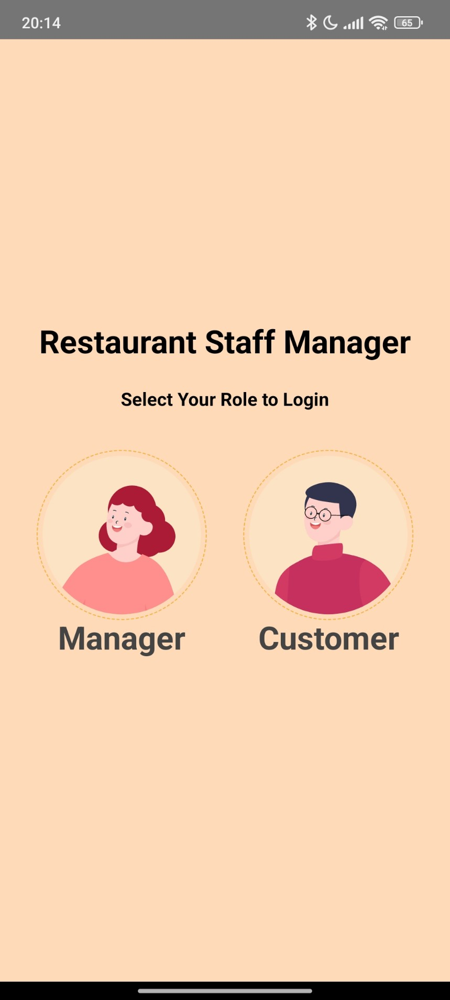
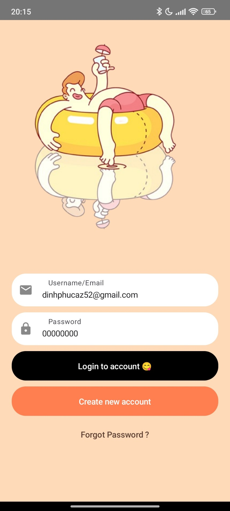
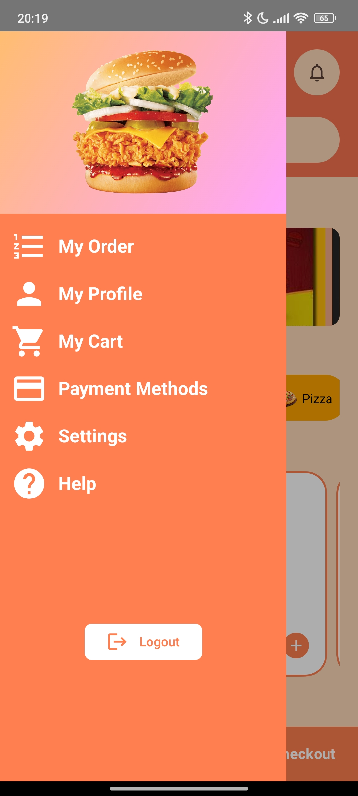
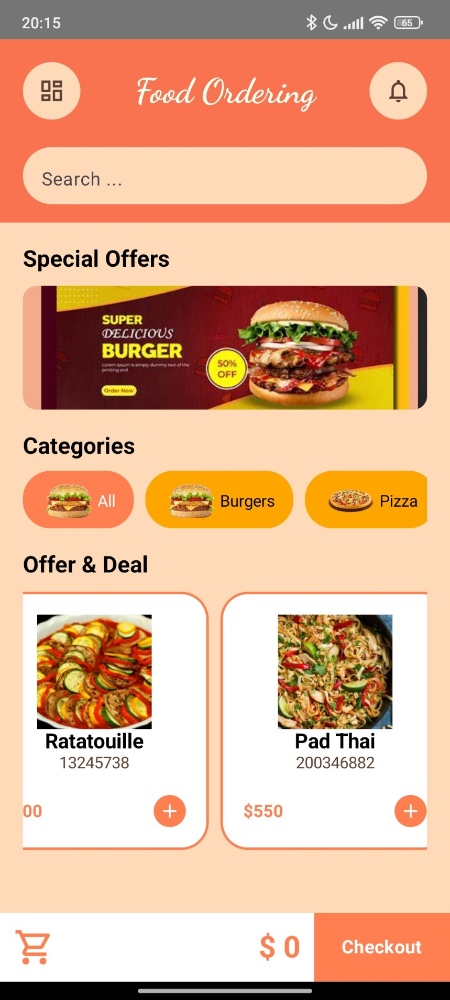
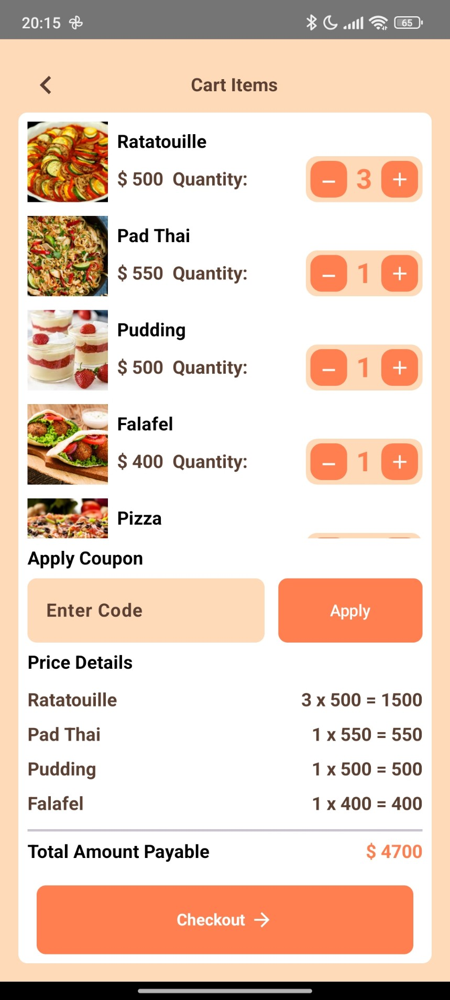
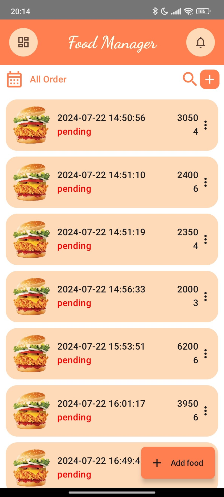

# Food Management App

## Overview

Food Management App is an Android application designed to help manage restaurant operations. This app allows users to add dishes, view bills, and customers can place orders. 

## Features

- **Add Foods:** Allows the management to add new foods to the menu.
- **View Bills:** Provides the functionality to view and manage bills.
- **Customer Orders:** Customers can browse the menu and place orders.

### Clone the Repository
```bash
git clone https://github.com/dinhphucaz2005/Food-Ordering.git
```

## Screenshots

<p align="center">
  
  
  
</p>

<p align="center">
  
  
  
</p>